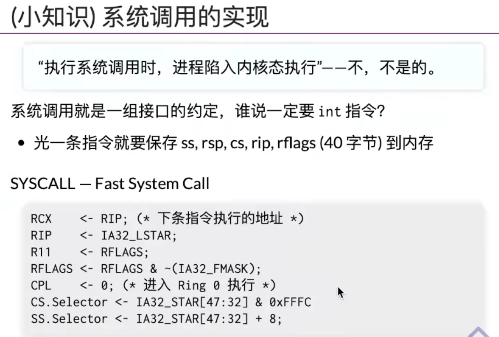

# 本次课回答的问题

**进程的地址空间是如何创建的、如何更改的。**

**进程的地址空间和管理。**

经过等价转换之后，汇编语言的状态机如下图所示。

# 查看进程的地址空间

* 大端模式

  是指数据的高字节保存在内存的低地址中，而数据的低字节保存在内存的高地址中，这样的存储模式有点儿类似于把数据当作字符串顺序处理：地址由小向大增加，数据从高位往低位放；这和我们的阅读习惯一致。

* 小端模式

  是指数据的高字节保存在内存的高地址中，而数据的低字节保存在内存的低地址中。8086就是这种模式

查看进程的地址空间，发现它是由若干个段组成的。

* 比如第一个，从0x400000开始，连续8K的地址空间，可读可执行，这是代码段

好奇的是，如果让你写一个pmap指令，你怎么办？

计算机世界中，所有的程序都是有源代码的，命令行也是程序。

可以通过strace，查看pmap使用了哪些系统调用。

**在Linux系统中， strace是一种相当有效的跟踪工具，它的主要特点是可以被用来监视系统调用。我们不仅可以用strace调试一个新开始的程序，也可以调试一个已经在运行的程序（这意味着把strace绑定到一个已有的PID上）。**

anon是anonymous，匿名的，不告诉你。

可以看到，程序调用了一个openat的系统调用，打开了/proc/37562/maps的文件。

在手册中，/maps查找maps。可以看到手册写的很详细。

开了一个1GB的数组，发现多了一个1GB的内存区。

# VDSO：非陷入系统调用

The virtual dynamically linked shared object

我们既想执行系统调用，又不想使用syscall指令执行。

Syscall比INT 高效的多

# 地址空间管理：mmap

本来进程的地址空间中是没有libc的，打了一个断点，然后继续执行一步之后，libc出现了

通过mmap这个syscall系统调用，可以实现对进程地址空间的写入或者删除。

通过mmap，就可以把全部/部分在其他地方打开的文件，映射到进程地址空间

# 突破进程隔离：游戏修改器/外挂

地址空间：实现进程隔离

每个进程都不能访问其他进程的地址空间。 如果你想去侵犯另一个进程的内存，操作系统会阻止你去做这一点。

普通的软件，按理来说是应该可以支持修改其他进程的内存的，比如说gdb调试器，所以说操作系统就应该提供这种功能。 操作系统是一个非常通用的平台，它要支持各种各样程序和软件的执行。调试器应该可以attach到那个状态机上去，然后读写。

注意，这是在前互联网时代，单机游戏。

可以跳到一个自己实现的时钟里边。

软件热更新，在软件还在执行的时候，偷偷修改他的代码。

归纳成理论了。

