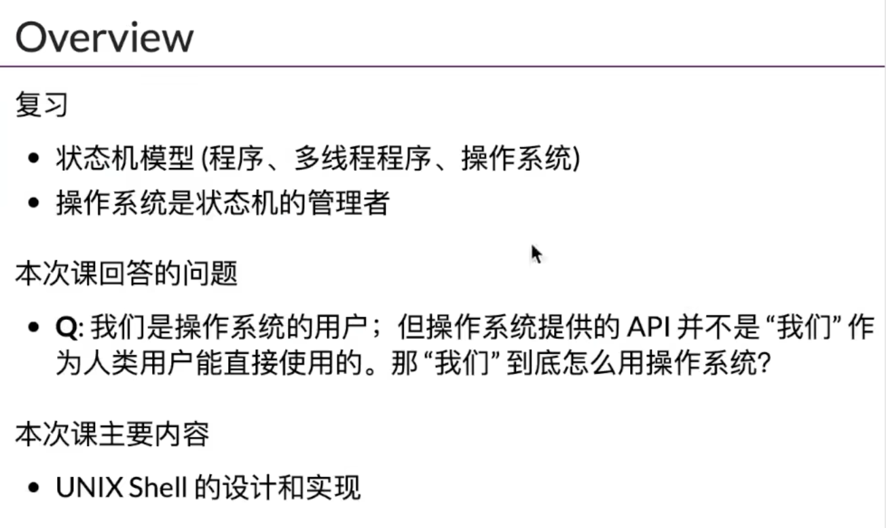 

# shell简介

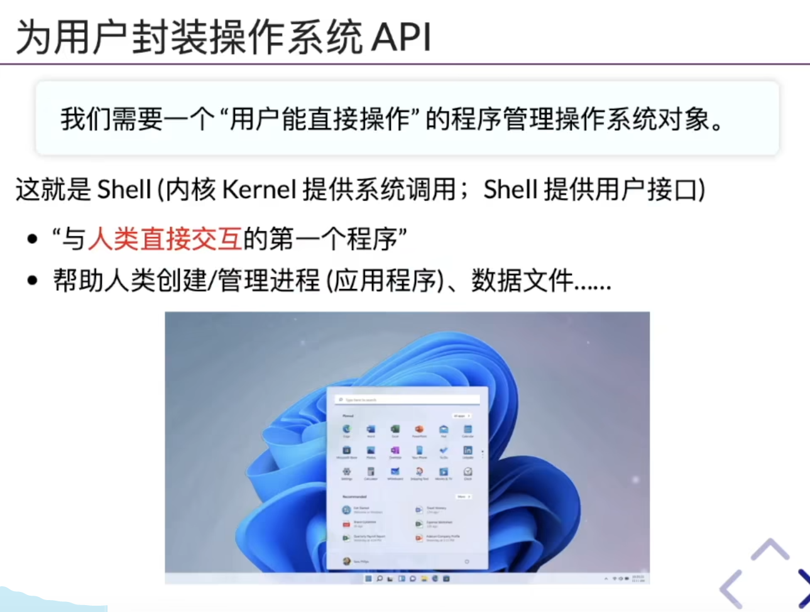

操作系统内核包含了所有系统调用的实现。

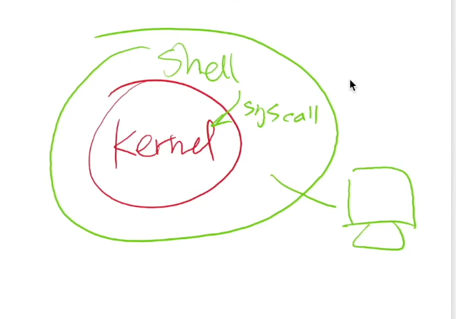

Shell是在Kernel外面的壳，和用户进行交互，所以叫Shell

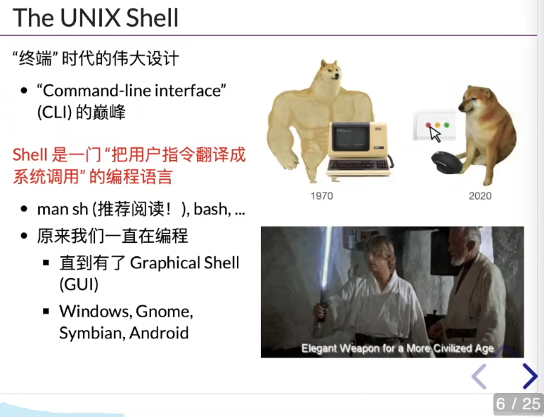

Shell是一门“把用户指令翻译成系统调用”的编程语言。

以前的人们有一个很强的能力，就是擅长读手册。因为不得不去读手册。老师推荐花一天读一下sh的手册，man sh。

# “零依赖”Shell的实现

## xv6的shell的实现

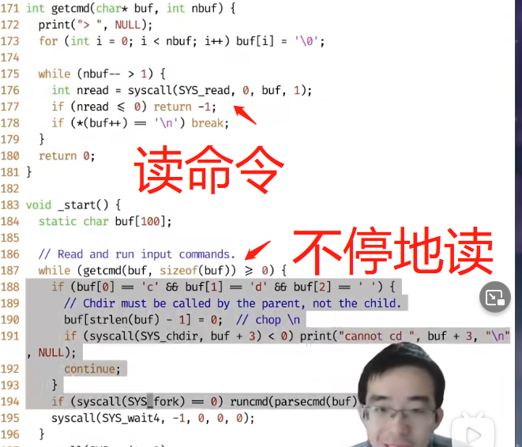

* 程序从_start开始执行，它判断是不是一条cd命令，方式是查看buf[0]是不是'c', buf[1]是不是'd'。所以他是不支持cd命令的前方有空格的。
* 然后去掉换行符号，buf + 3 跳过了cd和空格，只剩下后边的参数
* 没一个命令都是一个程序，我们shell所作的工作就是启动这些程序。

## Shell所作的事情和表达式求值是一样的

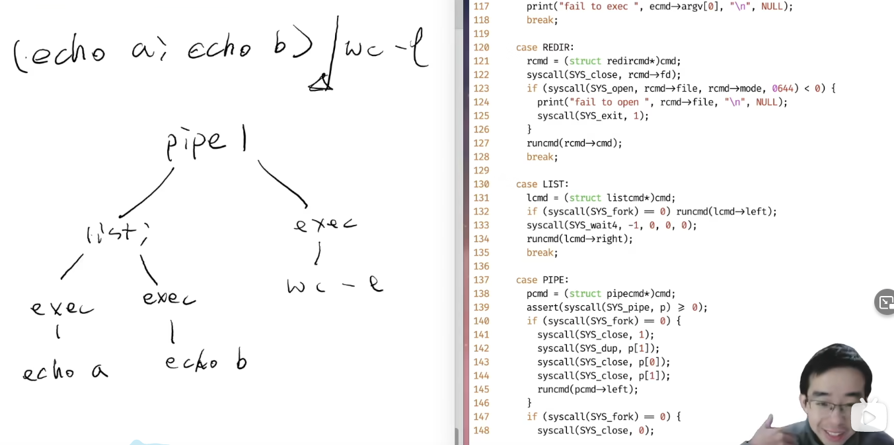

* Shell判断中间是一个管道pipe，然后就会建立一个树。

  左边是一个list，其中包含有两个exec：echo；右边直接就是一个exec：wc -l

* list所作的是什么？

  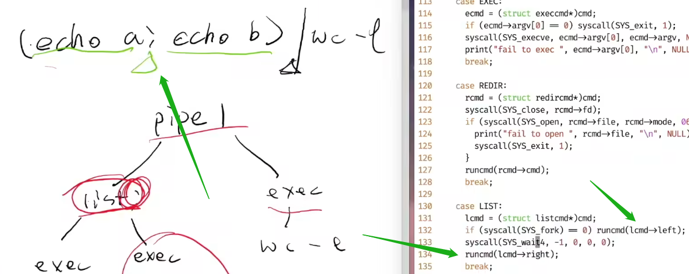

  递归了，先执行左边的，然后再递归执行右边的

  

* 管道|的设计理念 

  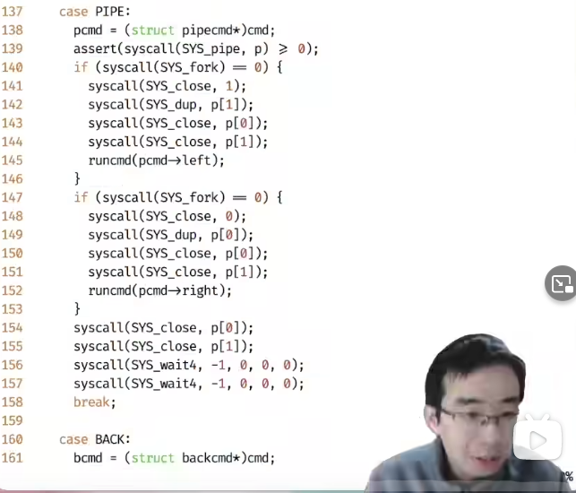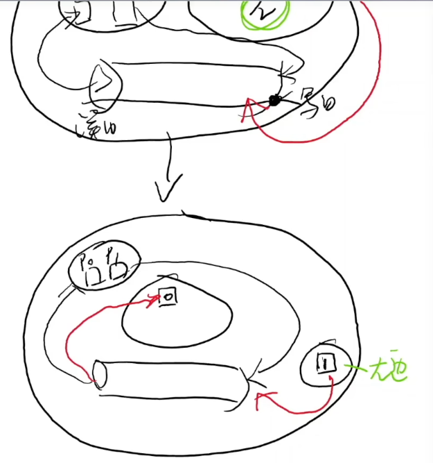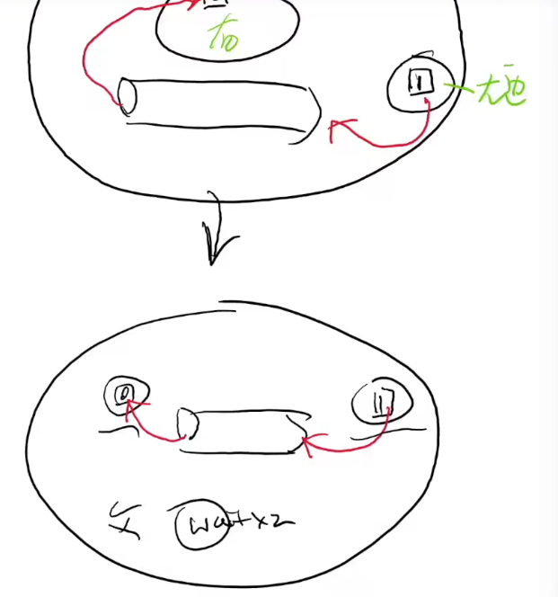这个设计比较巧妙，具体的可以看视频。

  Unix Shell其实就是一个编程语言。回到1970年，那个时候的码农是真的惨，他们无时无刻不在编程。 

  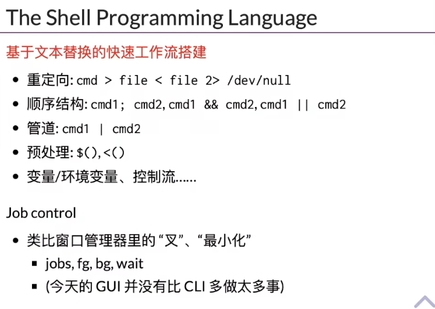

  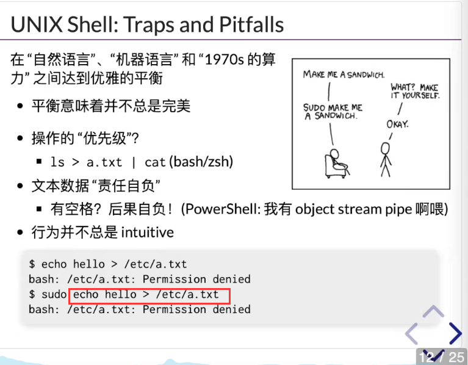

  至于为什么会没有权限，是因为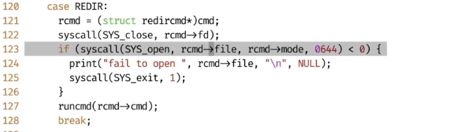

  

  Unix Shell其实是把命令翻译成一棵树，然后把把树翻译成系统调用

  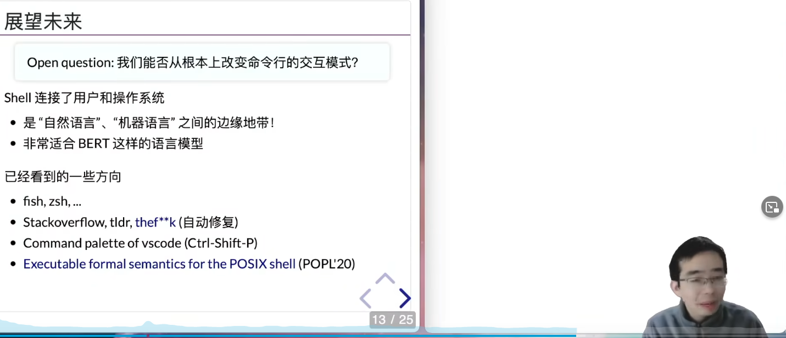

  现在已经有了更加现代化的Shell，能不能自动补全？

  # 终端和Job Control

  为什么有时候按ctrl+c可以退出程序，为什么在vim里边按下ctrl+c又不能退出程序。

  为什么没有监听ctrl+c, 但是仍然可以退出？

  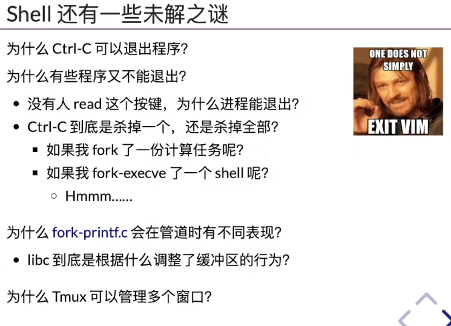

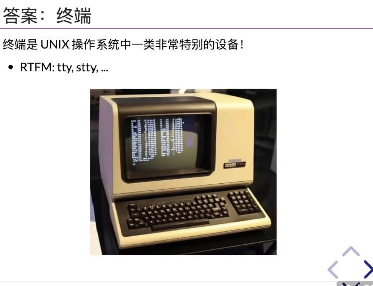

终端是Shell和人之间的媒介。

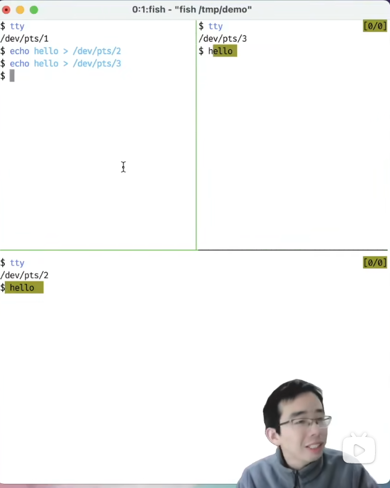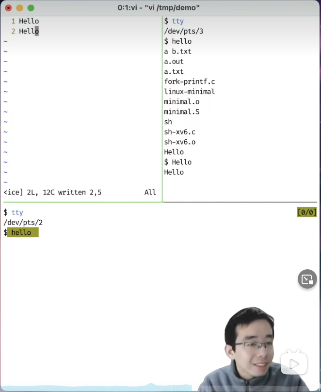

他竟然可以让Tmux的一个窗口的东西打印到另一个窗口。

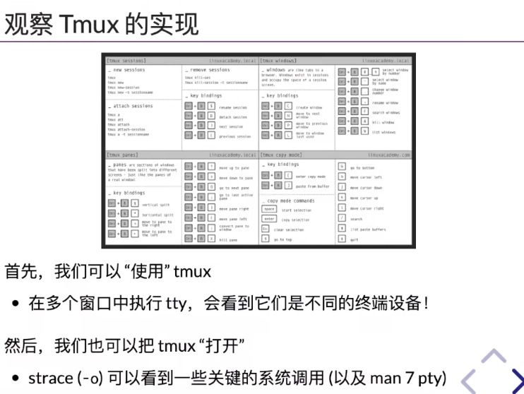

其实tmux就是捕捉各个窗口的输入，然后转发给对应的Terminal

ctrl+c可以退出的原因呢，就是操作系统有一个信号机制，信号其实是终端产生的，按下的时候，终端会给前台进程发一个信号，收到信号之后，进程会有相应的信号处理程序。

如果进程没有注册SIGINT，就会默认自动退出。

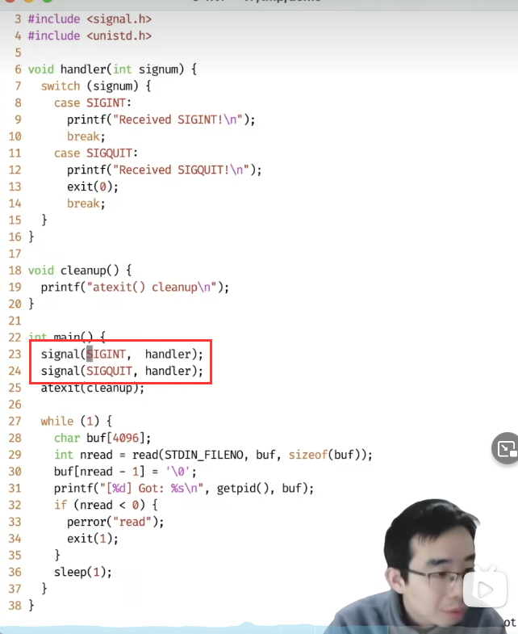

这都是操作系统设计者设计的啊，牛

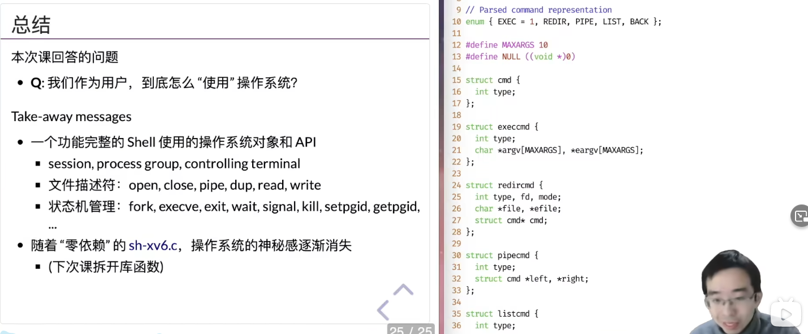
