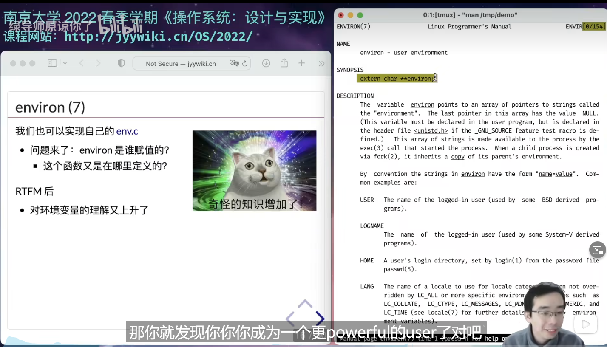

讲了Shell和命令行之后，我们很自然地想要往外更走一步，为应用提供更好的支撑。

本次课回答的问题：如何在系统调用之上构建程序能够普遍使用的标准库？

本次课主要内容：

* C标准库的设计与实现
* 基于libc的应用程序

# 系统调用和计算的封装, 熟悉又陌生的libc

int一定是四个字节吗？long一定是8个字节吗？不一定，这只是在32位机上是这样的。

所以为了保证int的字节数是确定的，保证他的可移植性，所以在定义的时候，用到了_t,t是type的意思，intptr_t保证可以容纳下一个指针。

## 系统调用的封装

直接使用那些裸奔的系统调用太繁琐了，所以实现了syscall，对系统调用进行封装。

系统调用也要用的方便。

execlp中使用了execve系统调用，这是一个系统调用的封装

## 计算的封装

printf的buffer要对线程安全性负责。而memset它就不管，谁最后写进去，就是谁的值。

随着编程语言的一点点进步，不满足于汇编语言，从而你就有了C，不满足于C，然后就有了C++，就这样一层一层往上封装，抽象。

# 文件描述符和进程状态的封装

## 文件描述符的封装

操作系统除了程序以外，还有很多的对象。比如执行pipe()系统调用的话，会创建管道对象，同时还会有文件描述符。操作系统还有终端这样的对象。

而我们的libc还有一个很大的功能就是帮我们封装操作系统中的对象。

无论是Unix还是当前的Linux，访问操作系统对象最主要的方法就是文件描述符。什么是文件描述符呢？就是一个打开了的文件。

我们知道，在Unix世界里，everything is a file，原则上你可以用文件描述符访问操作系统里的任何对象。然后文件描述符里有一系列的像read，write这种系统调用。

然后我们的libc当然要对文件描述符这样的东西有一个封装

打开了一个指针fp，然后往a.txt中写入。

发现使用了openat系统调用，返回一个文件描述符3，然后执行write系统调用。

base是从哪里开始写的，ptr是下一个写到哪里，end是写到哪里算满。

IO_buf_base就可以得到buffer里的值。

所以可以看到libc，可以封装纯粹的计算，也可以封装系统调用，也可以封装文件描述符，所以这就是全世界。

除了fopen之外，还有其他的文件描述符的封装。

下边分别是Python和Rust的封装，很高级啊。

越现代的编程语言，其实对我们的系统调用做了更多的封装。让你用起来更舒服，但是其实这都是海量的代码。

无论是你用什么命令，在没有这个文件的时候，它的错误提示信息都是一样的，它应该不是没一个应用程序单独做的，对吧？

使用了头文件err.h, 然后都使用了warn这个函数。

其实就是广泛地被我们的Unix程序员代代相传，不管是手册也好，还是上课的时候介绍的示例代码也好，然后会在开源的软件里看到这样的用法，然后你们也会集成/继承这样的用法，然后一代一代人，就会把这样的用法传下来，直到有一个破局的人出现，比如说Rust。他说你们不应该这样了，你们应该用一种更加现代化的方式来写代码。

但是至少C语言这个标准已经被广泛地接受了

到底是谁给这个environ变量赋值的？

使用gdb进行调试，刚开始p，查看这个变量，还没有值，wa，搞一个watch point，c

它给赋的值。所以说有什么不知道的，可以gdb调试，或者strace一下。

至于为什么老师知道要extern  char **environ，是因为手册中说了，所以就自己写了一个这个，然后调试。这就是一个更加powerful的User。

# 地址空间的封装：malloc和free

原来的进程的地址空间中有stack，bss，data，code。使用pmap看过地址空间以后，发现绝大部分是空的。如果我想申请内存，我可以使用mmap的方式，比如说获得1G的内存，操作系统把物理地址填到页表里。无论干什么你都需要分配内存，所以对于操作系统来说malloc和free就是非常重要的。

抽象一下，大概就是这样一个算法题：

在一个左闭右开的内存区间维护一个数据结构，支持malloc和free操作。每次分配的区间都是不相交的。 malloc每次需要把左端点返回给它；free需要把指定的区间回收掉。这就是一个区间管理的问题。

想用什么线段树红黑树这种东西去解决？这其实是一个陷阱。

真实的情况比这个复杂多了。需要保证线程安全.....还是多处理器的环境....需要考虑到各种case。怎么做呢？找一个比较近一点的paper。

所以workload的思想就是，让小对象的分配和创建越快越好。大对象稍微慢一点可以，但是小对象需要高的并行性。所以那些算法书上学到的算法，针对串行化的情况，可能都不Work。

非常郑重地向大家推荐libc的手册，不是很长......

想看真正的libc的实现的话，可以去看newlib。

用C啥也能写出来

libc + 编译器约定的二进制文件的格式，然后配上系统调用，就可以实现openjdk，Cpython，C++，Rust，就可以构造出你看到的计算机世界的全部。

1980年代或者1990年代，整个计算机世界都是在libc上实现的。

这就是上半个学期的内容了。上半学期讲的是红箭头和绿箭头。

后半学期要将黄色箭头了，要把操作系统Kernel打开。实际上也不难，操作系统内核就是一个C程序