之前讲的是操作系统上边的部分，现在向下来走。接下来讲一下怎么实现这些API。

# 复习

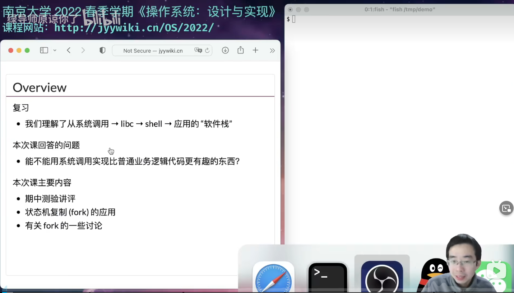

并发编程就是很难

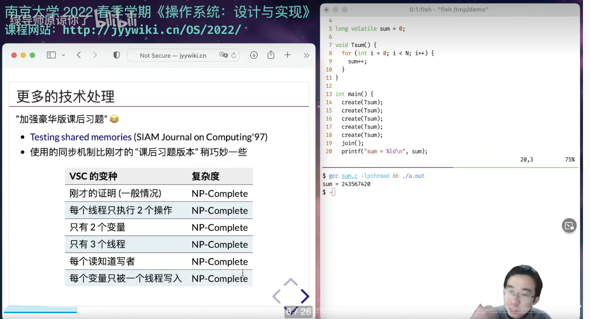

# 文件描述符的复制

前面讲到的管道就是这么实现的。

文件描述符的定义，简单又直观。

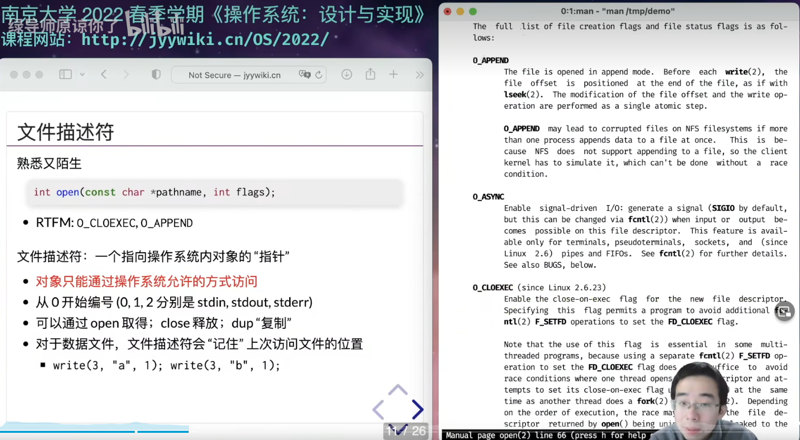

操作系统开始变复杂了

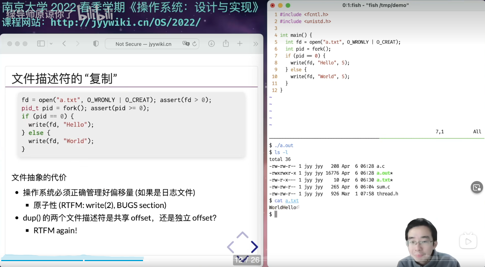

打印出来的是HelloWorld或者WorldHello。不可能是一个把另一个覆盖了。

dup()完之后是共享offset的，因为手册中说明的，看手册。

# 写时复制

fork的时候，使用的内存也被复制了吗？

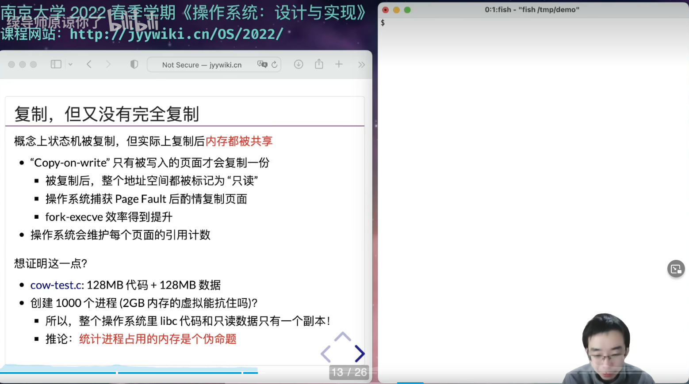

是的，进程只拥有虚拟地址空间，跟物理地址的映射需要通过mmu

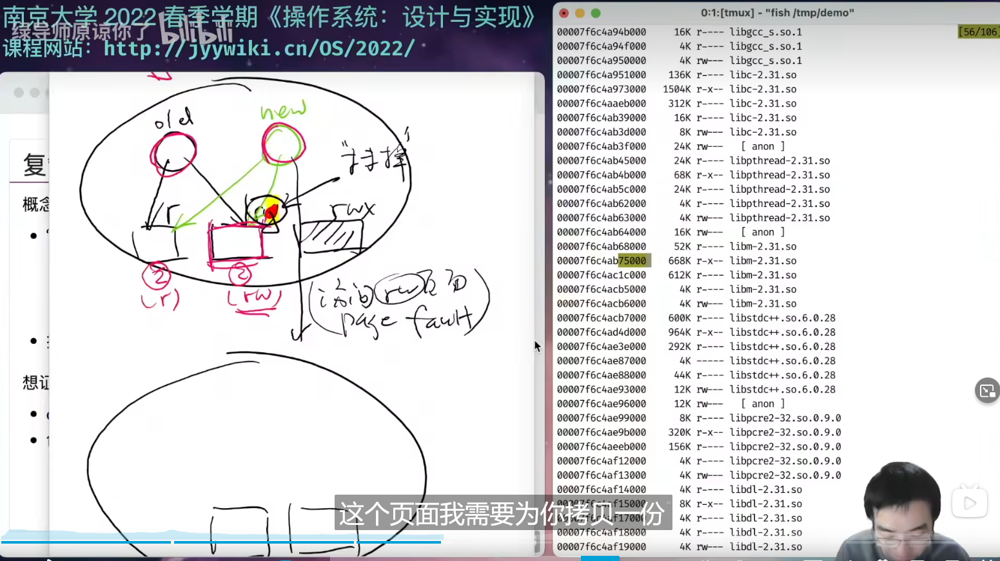

终于知道为啥要动态链接了。所以说，内存中libc只有一份。 

objdump反汇编看一下

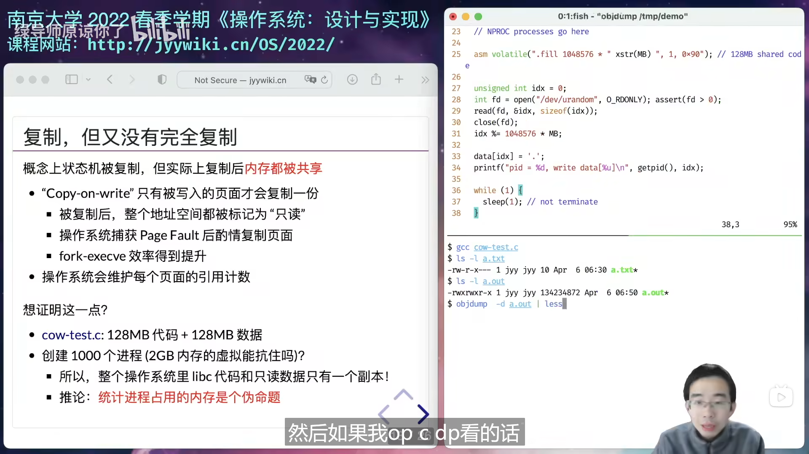

确实，统计进程占用的内存就是一个伪命题。  操作系统中的进程是共享内存的，libc就只有一个副本，你怎么算都不对。

# 平行宇宙和魔法

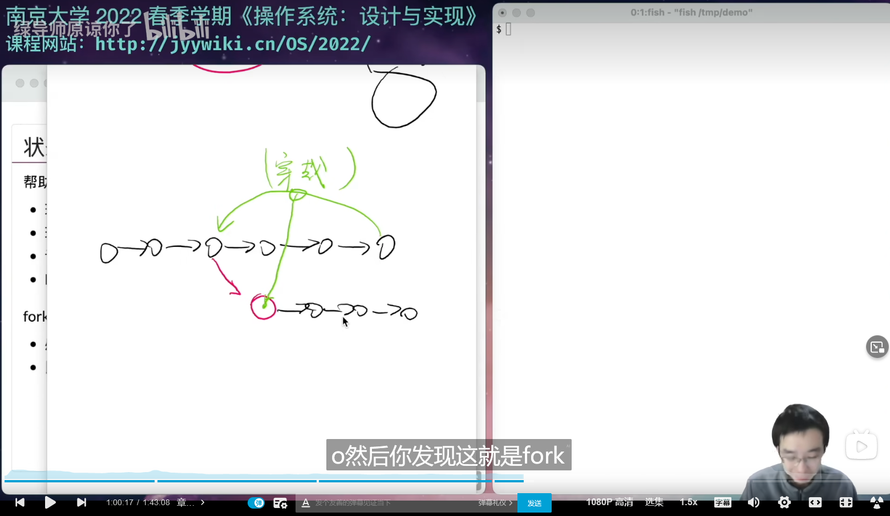

复制一份，然后回到过去，把自己杀掉。fork系统调用某种程度帮助你去做一个平行宇宙。

开始举例子——八数码

然后使用fork实现传统的DFS。对啊，使用fork创建平行宇宙的话，你就不需要回溯了。

确实是这样的。

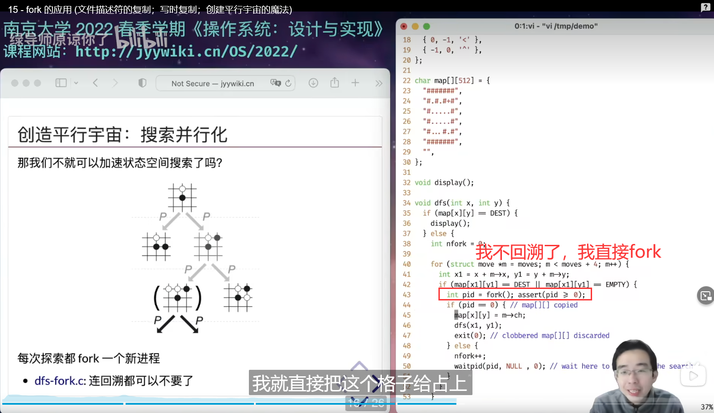

然后这些fork出来的子进程可以并行地执行。

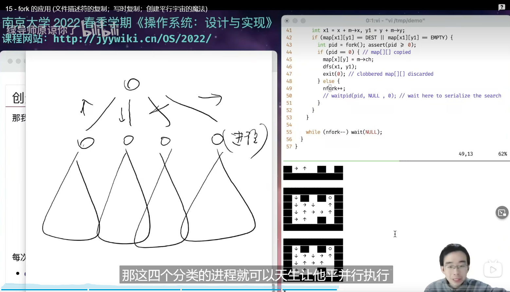

然后就可以瞬间地输出所有的情况。

实际应用。Android，一次加载，全部使用。否则打开某个应用就会很慢。

Chrome也牛啊，快。这就是fork的作用。它不仅可以并行化，还可以跳过初始化。

fork功能真是强大，不但节省内存还节约时间

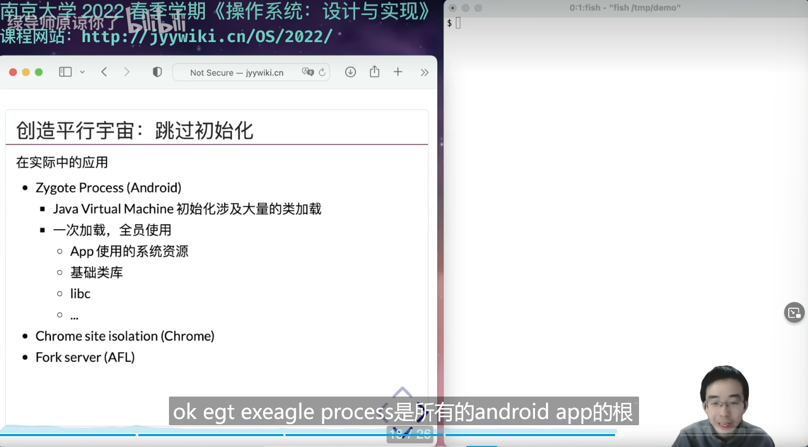

快照出现了！

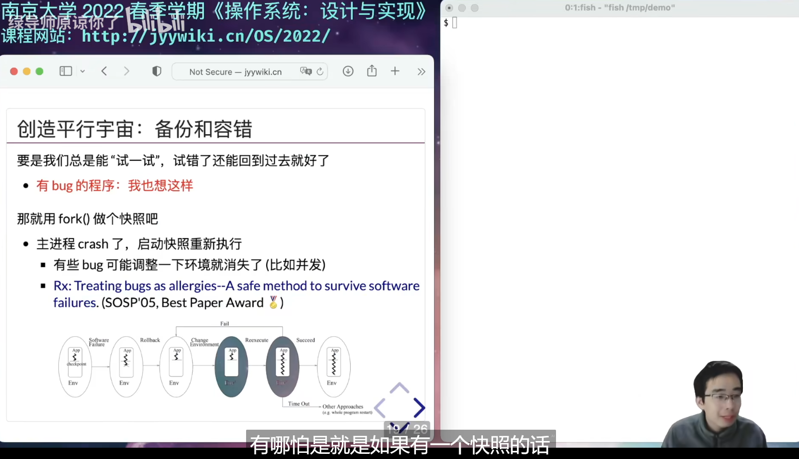

# 广告

计算机软件研究所——签订契约，成为魔法少女。

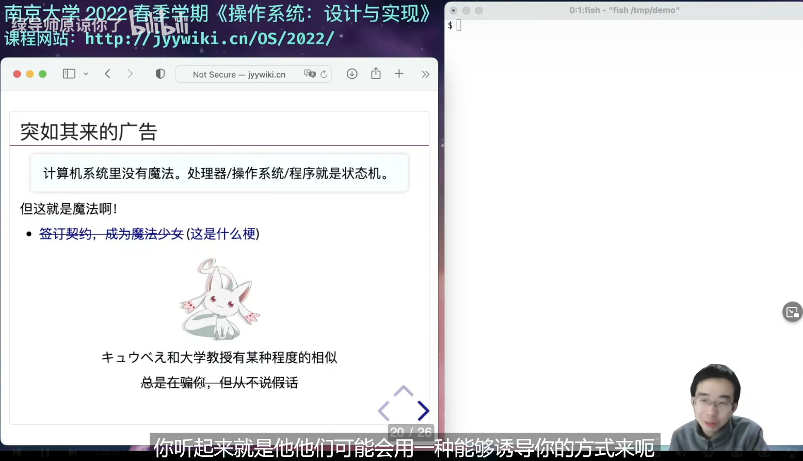

# Fork的讨论

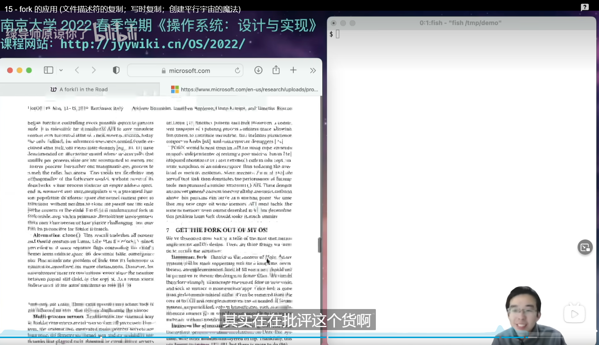

一群微软的大佬在批评这个fork。

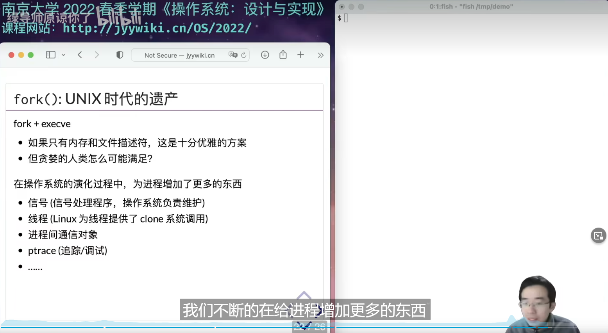

比如说给fork出来的两个进程ctrl+c，到底是谁结束？

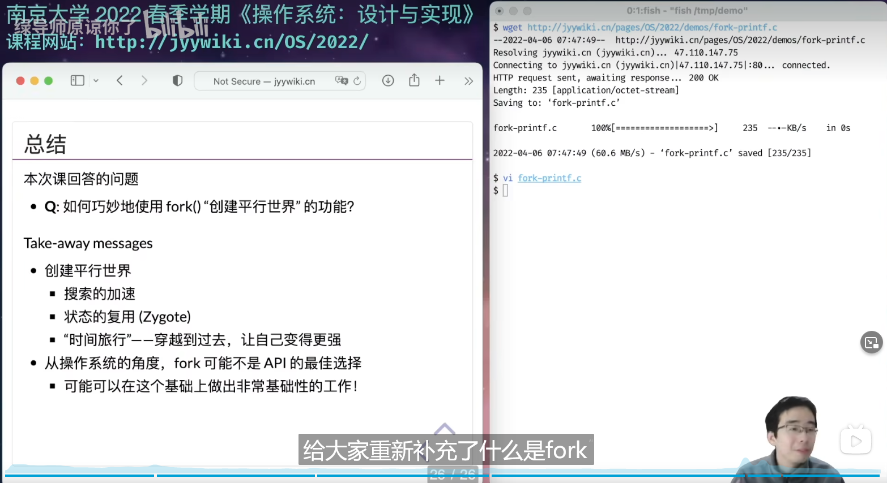

好的，今天给大家重新补充了什么是fork，更加详细地解释了fork的行为，然后以及fork在状态机的意义上就是复制就是创建一个平行事件。

# 实验

本周有大量的阅读材料——主要是和虚拟内存相关的。我们已经在课堂上为大家建立了基础的认识和模型，例如进程并不 “持有”  所有的页面，而是操作系统持有进程的页面，但操作系统会为每个进程布置一个虚拟内存翻译函数  $f$。即便概念简单，但其中涉及的细节是相当多的；一方面大家会在实验中体验它